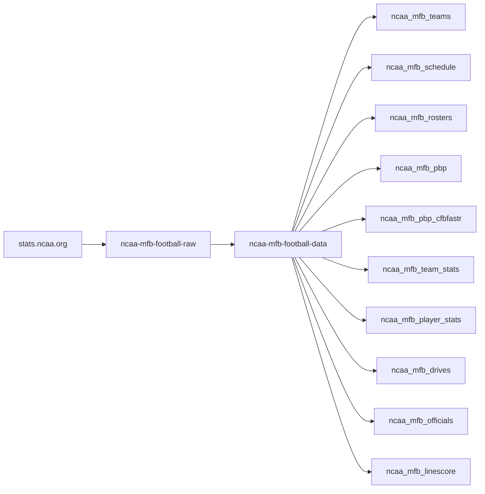
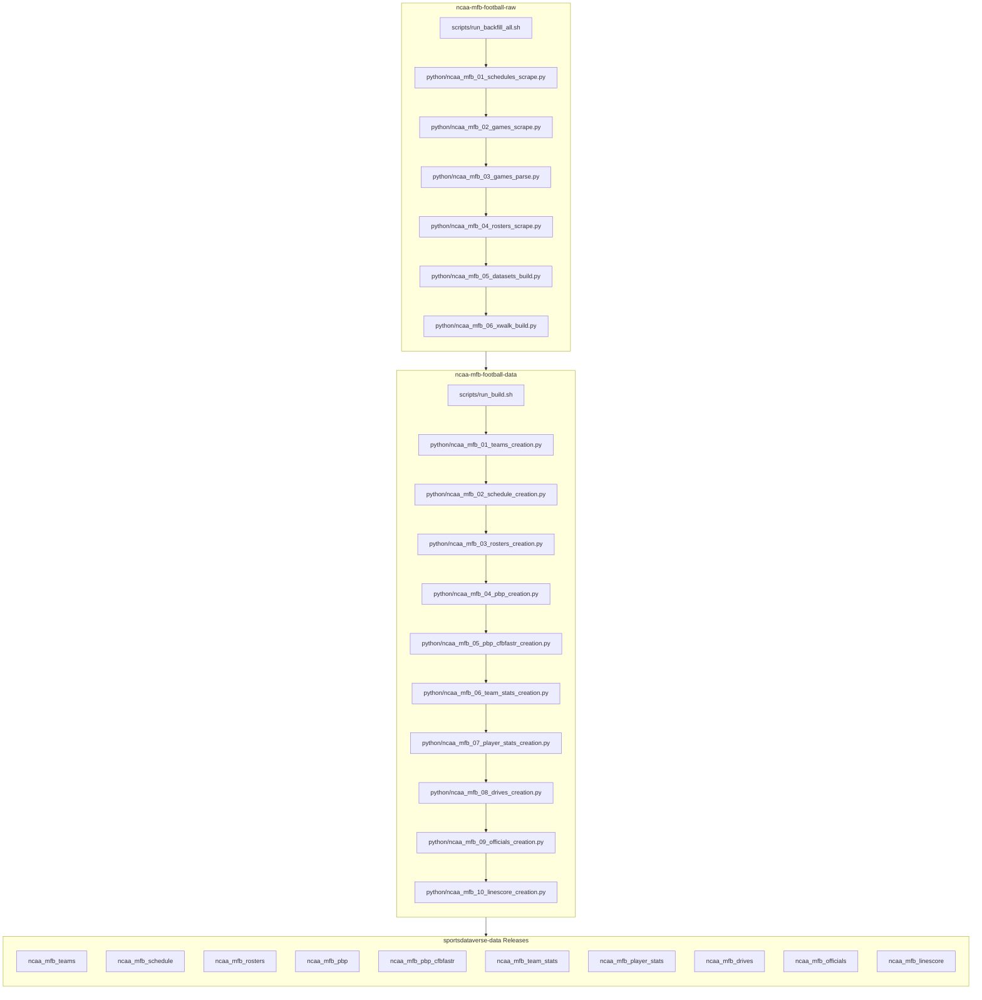

# ncaa-mfb-football-data

Python producer for the **NCAA football (MFB)** release datasets built from
`stats.ncaa.org`. Mirrors [`ncaa-mbb-hoops-data`](https://github.com/sportsdataverse/ncaa-mbb-hoops-data)
/ [`ncaa-wbb-hoops-data`](https://github.com/sportsdataverse/ncaa-wbb-hoops-data).

Pipeline: `stats.ncaa.org -> ncaa-mfb-football-raw -> ncaa-mfb-football-data [HERE] -> sportsdataverse-data`

**Status: live.** This repo owns the reshape stage (the WBB/MBB standard):
game-grain datasets build from the raw repo's parsed+enriched
`mfb/json/{contest_id}.json.gz` payloads (stage 03 -- espn_game_id and team
ids included); reference datasets (teams/schedule/rosters) re-key the raw
tree's parquet. Publishing (parquet + csv.gz + rds per season, ported from
`ncaa-wbb-hoops-data`) uploads to `sportsdataverse/sportsdataverse-data`.
Numbered `python/ncaa_mfb_NN_{dataset}_creation.py` shims mirror the twins;
`tests/test_stage_inventory.py` gates the set and order. A per-season QA
frame (final-score parity incl. the name-blind `scores_match`) is committed
under `mfb/qa/` and never released.

## ncaa-mfb-football workflow diagram





`scripts/run_backfill_all.sh` (raw) and `scripts/run_build.sh` +
`scripts/run_publish.sh` (data) are the drivers. Stage numbers are intended
build order, not run order.

[ncaa-mfb-football-raw repository (source: stats.ncaa.org)](https://github.com/sportsdataverse/ncaa-mfb-football-raw)

[ncaa-mfb-football-data repository (source: stats.ncaa.org)](https://github.com/sportsdataverse/ncaa-mfb-football-data)

[cfbfastR-cfb-raw repository (source: ESPN)](https://github.com/sportsdataverse/cfbfastR-cfb-raw)

[cfbfastR-cfb-data repository (source: ESPN)](https://github.com/sportsdataverse/cfbfastR-cfb-data)

## Input contract

This repo consumes the committed output of
[`ncaa-mfb-football-raw`](https://github.com/sportsdataverse/ncaa-mfb-football-raw)
(its stage 05, `mfb_datasets.py` — fully offline, parsing via sdv-py
`cfb_ncaa_pbp` / `cfb_ncaa_box`), read from the sibling checkout
`../ncaa-mfb-football-raw` or `NCAA_MFB_RAW_ROOT`:

| raw path (`{ay}` = ENDING academic year) | release dataset |
| --- | --- |
| `mfb/teams/parquet/{ay}_div{11,12}.parquet` | `teams` (concat; `division` 11=FBS, 12=FCS) |
| `mfb/schedules/parquet/{ay}.parquet` | `schedule` (one row per team-game, `contest_id`) |
| `mfb/rosters/parquet/{ay}.parquet` | `rosters` (stats.ncaa.org `player_id`) |
| `mfb/datasets/{ay}/pbp.parquet` | `pbp` (structural NCAA pbp) |
| `mfb/datasets/{ay}/pbp_cfbfastr.parquet` | `pbp_cfbfastr` (cfbfastR-named play frame) |
| `mfb/datasets/{ay}/team_stats.parquet` | `team_stats` |
| `mfb/datasets/{ay}/player_stats_{cat}.parquet` | `player_stats` (diagonal concat, `category` from filename) |
| `mfb/datasets/{ay}/drives.parquet` | `drives` |
| `mfb/datasets/{ay}/officials.parquet` | `officials` |
| `mfb/datasets/{ay}/linescore.parquet` | `linescore` |

`contest_id` / `team_id` / `player_id` are NCAA **string** ids and stay `Utf8`.
`mfb/datasets/{ay}/qa_pbp_vs_linescore.parquet` is a raw-side QA artifact and
is not released.

**Season convention: STARTING year** — the football standard (cfbfastR / cfb /
nfl): `season = 2025` is the fall-2025 season, `2026` is the season kicking off
in fall 2026. The raw tree is keyed by stats.ncaa.org's ENDING academic year
(`mfb/datasets/{ay}/`, ay = season + 1); this build is the ONLY place that
re-keys, so the two conventions never mix downstream.

## Output contract

- **parquet**: committed in-repo under `mfb/{dataset}/parquet/` as
  `ncaa_mfb_{dataset}_{season}.parquet`, every frame stamped with `season`
  (Int64, ending year). The `ncaa_mfb_` prefix matches the release tag.
- **parquet + csv.gz + rds**: release assets on
  `sportsdataverse/sportsdataverse-data`, tagged `ncaa_mfb_{dataset}`, staged
  under the gitignored `mfb/_release_build/` (`io.py` / `rds.py` / `publish.py`,
  ported from `ncaa-wbb-hoops-data` — per-file `gh release upload --clobber`,
  create-if-missing, `GhUnavailable` resume semantics).

## Run order

```bash
uv sync --frozen
SEASON=2025 bash scripts/run_build.sh                  # all datasets
SEASON=2025 DATASET=pbp_cfbfastr bash scripts/run_build.sh
# or directly:
uv run python -m ncaa_mfb_data_build build --dataset all --season 2025

# publish one season (build + stage csv.gz/rds + gh upload):
SEASON=2025 bash scripts/run_publish.sh
# full-history sweep (resumable; DRY_RUN=1 to stage without uploading):
bash scripts/run_historical_publish.sh                 # 2025 down to 2013
# audit built seasons vs what each release actually holds:
uv run python -m ncaa_mfb_data_build check
```

Offline; `NCAA_MFB_RAW_ROOT` defaults to `../ncaa-mfb-football-raw`. Backfill
= the same command with another `--season` (the raw repo must hold that
`mfb/datasets/{ay}/` first — see its RUNBOOK).

## Tests

```bash
uv run pytest -q
uv run ruff check python tests
```

Hermetic: `tests/test_build.py` fabricates a raw tree in `tmp_path`.

## Reports & explainers

<!-- BEGIN GENERATED: reports -->

| Report | What it is | Last updated |
|---|---|---|
| _none yet_ | — | — |

<!-- END GENERATED: reports -->

## Automation & status

<!-- BEGIN GENERATED: status -->

| workflow | schedule | last run |
|---|---|---|
| [](https://github.com/sportsdataverse/ncaa-mfb-football-data/actions/workflows/orphan_scripts.yml) | on push / PR / dispatch | 2026-08-24 |
| [](https://github.com/sportsdataverse/ncaa-mfb-football-data/actions/workflows/tests.yml) | on push / PR / dispatch | 2026-08-24 |

| release tag | assets | size | last publish |
|---|---:|---:|---|
| [`ncaa_mfb_teams`](https://github.com/sportsdataverse/sportsdataverse-data/releases/tag/ncaa_mfb_teams) | 39 | 0.1 MB | 2026-08-24 |
| [`ncaa_mfb_schedule`](https://github.com/sportsdataverse/sportsdataverse-data/releases/tag/ncaa_mfb_schedule) | 39 | 2.2 MB | 2026-08-24 |
| [`ncaa_mfb_rosters`](https://github.com/sportsdataverse/sportsdataverse-data/releases/tag/ncaa_mfb_rosters) | 39 | 18.5 MB | 2026-08-24 |
| [`ncaa_mfb_pbp`](https://github.com/sportsdataverse/sportsdataverse-data/releases/tag/ncaa_mfb_pbp) | 39 | 388.6 MB | 2026-08-24 |
| [`ncaa_mfb_pbp_cfbfastr`](https://github.com/sportsdataverse/sportsdataverse-data/releases/tag/ncaa_mfb_pbp_cfbfastr) | 39 | 760.7 MB | 2026-08-24 |
| [`ncaa_mfb_team_stats`](https://github.com/sportsdataverse/sportsdataverse-data/releases/tag/ncaa_mfb_team_stats) | 39 | 78.1 MB | 2026-08-24 |
| [`ncaa_mfb_player_stats`](https://github.com/sportsdataverse/sportsdataverse-data/releases/tag/ncaa_mfb_player_stats) | 39 | 30.3 MB | 2026-08-24 |
| [`ncaa_mfb_drives`](https://github.com/sportsdataverse/sportsdataverse-data/releases/tag/ncaa_mfb_drives) | 39 | 21.1 MB | 2026-08-24 |
| [`ncaa_mfb_officials`](https://github.com/sportsdataverse/sportsdataverse-data/releases/tag/ncaa_mfb_officials) | 39 | 1.9 MB | 2026-08-24 |
| [`ncaa_mfb_linescore`](https://github.com/sportsdataverse/sportsdataverse-data/releases/tag/ncaa_mfb_linescore) | 39 | 2.9 MB | 2026-08-24 |

<!-- END GENERATED: status -->
